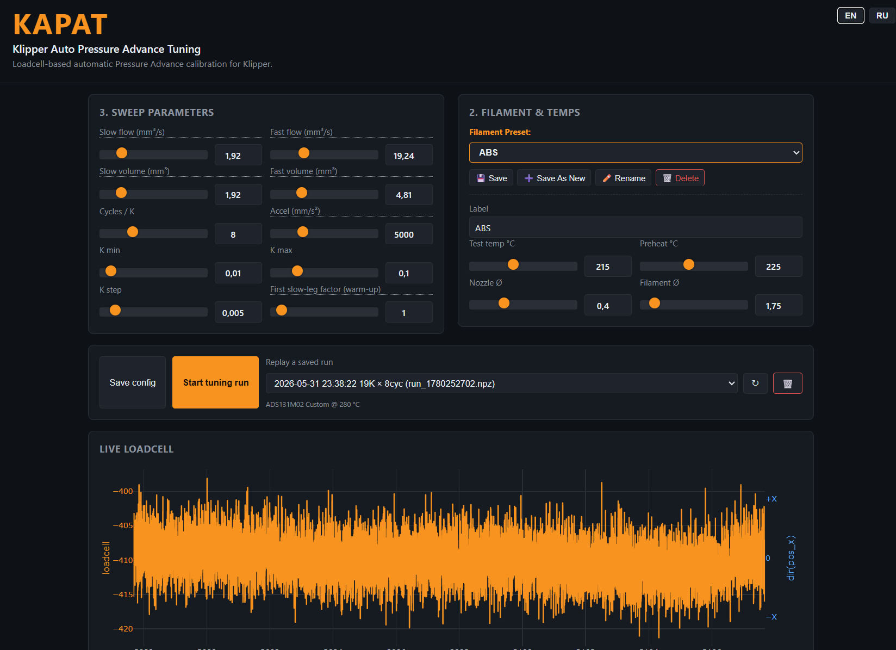
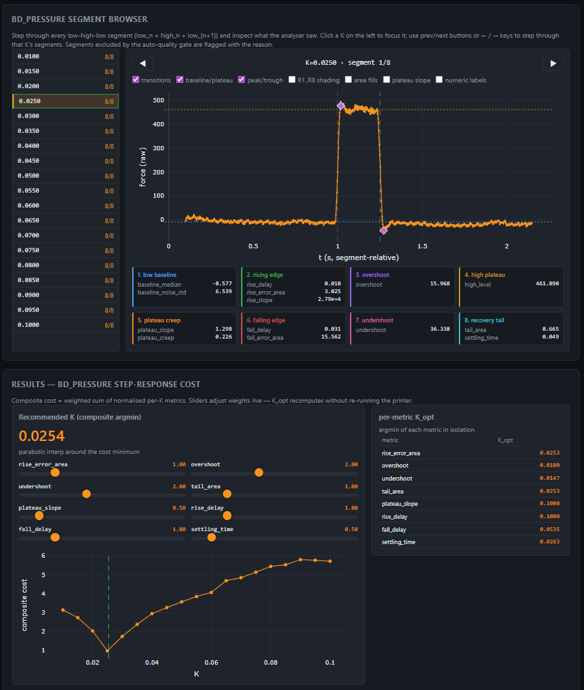
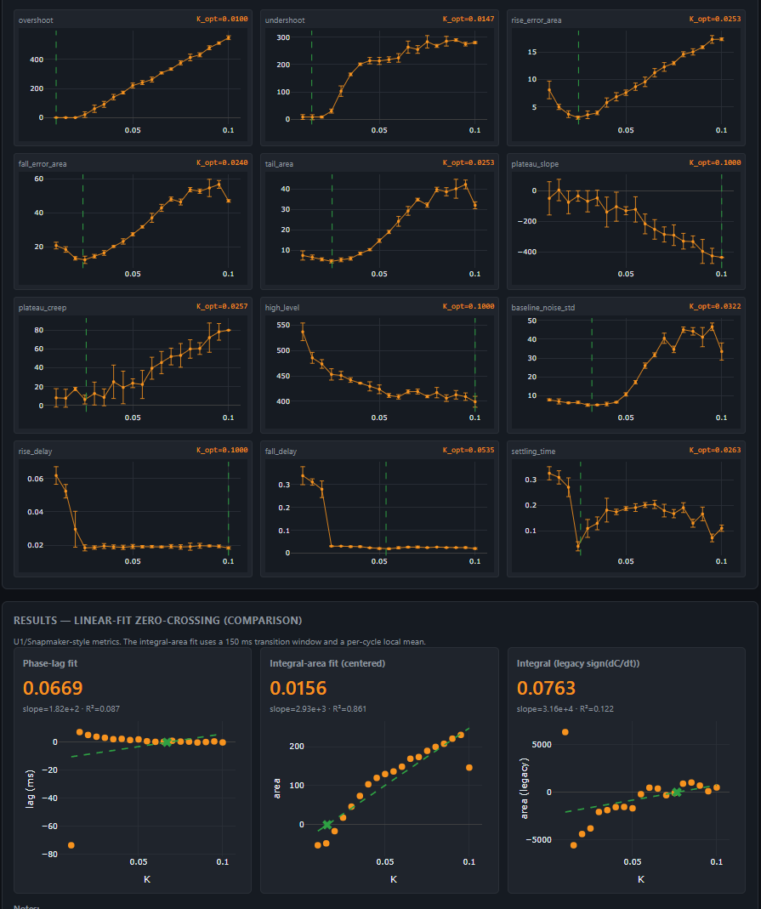

# KAPAT - Klipper Auto Pressure Advance Tuning

**KAPAT** is a loadcell-based automatic Pressure Advance calibration tool for Klipper, based on the original [PrusaPATuner by CNCKitchen](https://github.com/CNCKitchen/PrusaPATuner).

Unlike traditional visual calibration, this tool directly measures the pressure inside the nozzle using a loadcell (Strain Gauge) to calculate the optimal Pressure Advance value.

This fork features a **completely redesigned, modern, two-column UI**, optimized specifically for Klipper, with built-in filament preset management and an intuitive workflow.

<p align="center">
  
  
  
</p>

## Features
* **Klipper Native:** Fully adapted for Moonraker/Klipper API.
* **Modern UI:** Sleek dark theme with dual-column layout and intuitive sliders.
* **Preset Management:** Save and load your filament settings directly from the web interface.
* **Real-time Analytics:** Smooth live loadcell graph and per-segment step-response analysis.
* **Easy Cleanup:** Delete old `.npz` run files right from the dashboard.
* **Replay Engine:** Re-analyze previously recorded telemetry logs without heating up the printer.

## Installation & Usage

The easiest way to install KAPAT and all its dependencies on your Klipper host (Raspberry Pi, CB2, etc.) is using the automated installation script. 

Connect to your host via SSH and run this single command:

```bash
curl -sSL https://raw.githubusercontent.com/vzagranichnyy/KAPAT/main/install.sh | bash
```

The script will automatically:
1. Download the repository.
2. Create an isolated Python virtual environment (safe for Debian Bookworm).
3. Install all required dependencies (`fastapi`, `numpy`, `scipy`, etc.).
4. Copy the Klipper extra modules to the correct directory and restart Klipper.
5. Setup a background service so the KAPAT web dashboard starts automatically on boot.

**Important:** After installation, don't forget to include the provided macro in your `printer.cfg`:

```cfg
[include kapat.cfg]
```

Open `http://<your-pi-ip>:8000` in your browser to access the dashboard.

## Credits
* **Original Concept & Math:** [Stefan (CNCKitchen)](https://github.com/CNCKitchen).
* **Klipper integration & UI redesign:** Vitaliy Zagranichnyy.

---

# KAPAT - Автоматическая калибровка Pressure Advance для Klipper

**KAPAT** — это инструмент автоматической калибровки Pressure Advance для Klipper с использованием тензодатчика (loadcell), основанный на оригинальном проекте [PrusaPATuner от CNCKitchen](https://github.com/CNCKitchen/PrusaPATuner).

В отличие от традиционной визуальной калибровки (печати линий или башен), этот инструмент напрямую измеряет давление внутри сопла с помощью тензодатчика для вычисления оптимального значения Pressure Advance.

Этот форк (версия) включает в себя **полностью переработанный, современный интерфейс в две колонки**, специально оптимизированный для Klipper, со встроенным управлением пресетами для пластика и интуитивно понятным рабочим процессом.

## Особенности
* **Нативная работа с Klipper:** Полная адаптация под API Moonraker/Klipper.
* **Современный интерфейс:** Стильная темная тема с двухколоночной компоновкой и удобными ползунками.
* **Управление пресетами:** Сохраняйте и загружайте настройки для разных типов пластика прямо из веб-интерфейса.
* **Аналитика в реальном времени:** Плавный график показаний тензодатчика в реальном времени и детальный анализ каждого сегмента теста.
* **Легкая очистка:** Удаляйте старые файлы тестов `.npz` прямо с панели управления одним кликом.
* **Движок повторов (Replay):** Проводите повторный анализ ранее записанных логов телеметрии без необходимости снова нагревать принтер и тратить пластик.

## Установка и использование

Самый простой способ установить KAPAT и все его зависимости на ваш хост Klipper (Raspberry Pi, CB2 и т.д.) — использовать скрипт автоматической установки.

Подключитесь к вашему хосту по SSH и выполните эту команду:

```bash
curl -sSL https://raw.githubusercontent.com/vzagranichnyy/KAPAT/main/install.sh | bash
```

Скрипт автоматически:
1. Скачает репозиторий.
2. Создаст изолированное виртуальное окружение Python (безопасно для новых ОС Debian Bookworm).
3. Установит все необходимые библиотеки (`fastapi`, `numpy`, `scipy` и т.д.).
4. Скопирует модули в папку Klipper и перезапустит службу Klipper.
5. Настроит фоновую службу, чтобы веб-сервер KAPAT запускался автоматически при включении принтера.

**Важно:** После установки не забудьте добавить макрос в ваш `printer.cfg`:

```cfg
[include kapat.cfg]
```

Откройте `http://<IP-адрес-вашего-принтера>:8000` в браузере для доступа к панели управления.

## Авторы
* **Оригинальная концепция и математика:** [Stefan (CNCKitchen)](https://github.com/CNCKitchen).
* **Интеграция с Klipper и новый интерфейс:** Vitaliy Zagranichnyy.

## License
This project is open-source and builds upon the original work by CNCKitchen. Please refer to the `LICENSE` file in this repository for specific terms and conditions.