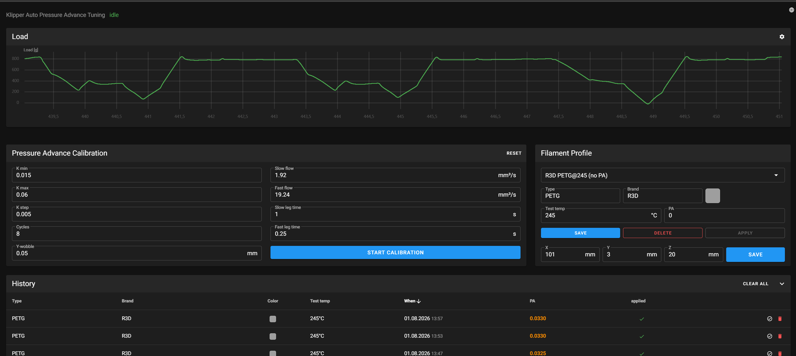
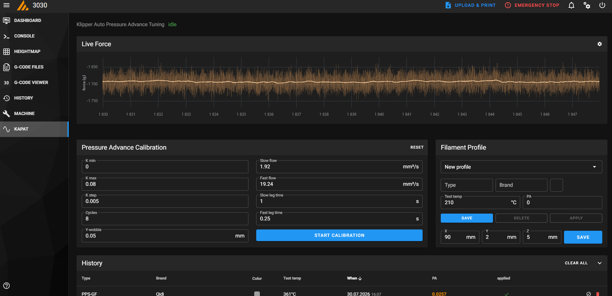
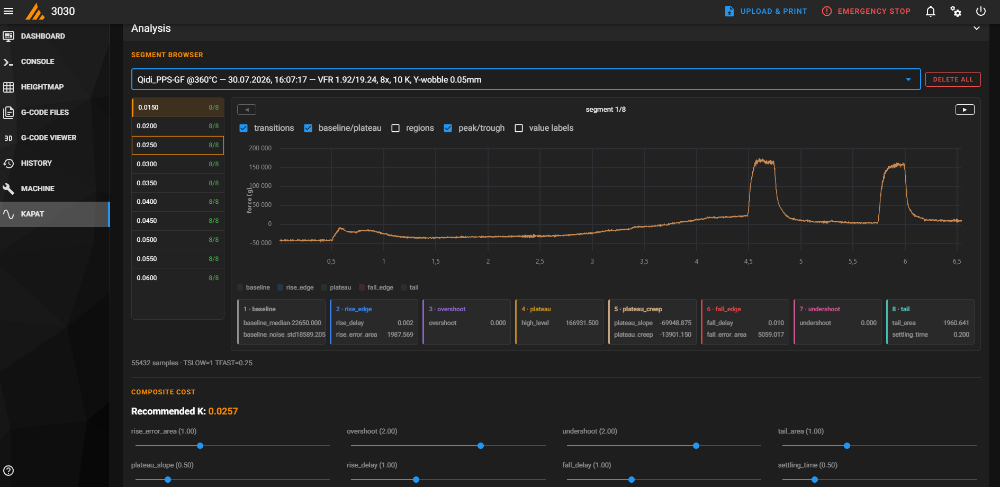
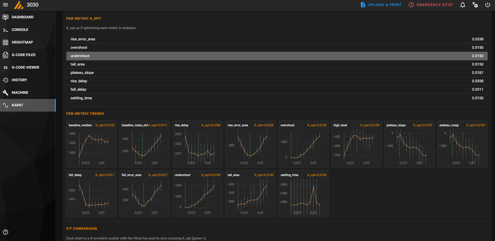
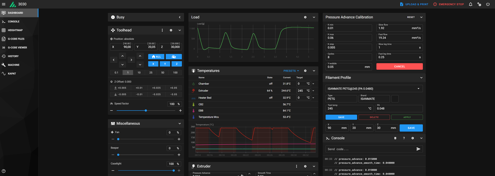
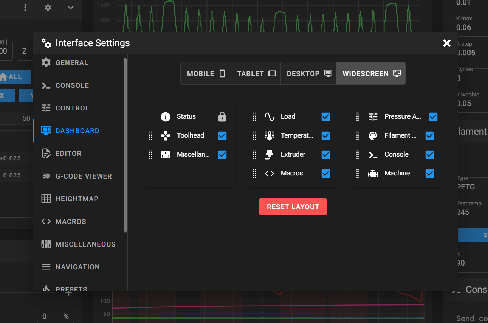

# KAPAT — Klipper Auto Pressure Advance Tuning

Automatic Pressure Advance calibration for Klipper, using a toolhead load
cell as a back-pressure sensor. No printed test patches, no eyeballing
corners.

Three sources, combined:
- **Data acquisition** (load-cell resolution, `get_collector()`/
  `start_collecting`/`collect_until`, the axis-wobble PA-gate requirement,
  exact per-cycle transition timing via `register_lookahead_callback`) —
  pattern from [G0BL1N/autopa](https://github.com/G0BL1N/autopa)
  (`autopa/sweep.py`).
- **Analysis math** (phase-lag cross-correlation, centered-window
  integral-area, linear-fit zero-crossing, 8-region/13-metric step-response
  analysis) — ported from
  [CNCKitchen/PrusaPATuner](https://github.com/CNCKitchen/PrusaPATuner)
  (`src/prusa_pa_tuner/analysis.py`).
- **Web UI** — two options, see below.

Validated end-to-end on real hardware (ADS131M02 load cell), including the
raw-segment Analysis browser and the composite/per-metric K_opt views.

## Two web UIs — pick one (or both)

**1. KAPAT web** (`web-dist/`) — a small standalone app, just the
calibration UI, nothing else. Served at `/kapat/` alongside whatever else
already runs on the printer's web server.

**2. Mainsail + KAPAT** (`mainsail-dist/`) — a full fork of
[Mainsail](https://github.com/mainsail-crew/mainsail) with a native
**KAPAT** tab built into its sidebar. Replaces your existing Mainsail
install outright (same UI you already use, plus the KAPAT tab) rather
than running alongside it. Source: [Mainsail-Kapat](https://github.com/vzagranichnyy/Mainsail-Kapat).

Both talk to the exact same Klipper backend (this repo's `klipper_extras/`)
and the same on-disk profiles/history/captures — switching between them
doesn't lose any data.

**KAPAT web** (`/kapat/`):



The Analysis tab looks the same as in the Mainsail fork below.

**Mainsail + KAPAT** (sidebar tab, plus optional dashboard panels):





The Load chart, Pressure Advance Calibration, and Filament Profile cards
are also available as individual panels on Mainsail's main Dashboard
tab (alongside Temperature/Extruder/Console), toggleable per-panel from
Interface Settings → Dashboard:




## Install

```bash
git clone https://github.com/vzagranichnyy/KAPAT.git
cd KAPAT
./install.sh                  # KAPAT web UI at /kapat/ (default)
./install.sh --web=mainsail   # Mainsail+KAPAT instead (replaces $HOME/mainsail)
./install.sh --web=both       # both
```

Both web UIs ship **pre-built** in this repo (`web-dist/`,
`mainsail-dist/`) — no Node.js/npm needed on the printer.

Then add the `[kapat]` section from `docs/printer.cfg.example` to your
`printer.cfg` and restart Klipper.

## Changing your mind later

```bash
./switch-web.sh --to=kapat     # KAPAT web UI (restores your original
                                # stock Mainsail if --web=mainsail ever
                                # replaced it)
./switch-web.sh --to=mainsail  # Mainsail+KAPAT (backs up whatever's
                                # currently at $HOME/mainsail first, once)
./switch-web.sh --to=both
```

## Removing it

```bash
./uninstall.sh
```

Removes the Klipper extra, the web UI deployment(s), and the nginx
`/kapat` location it added — restoring your stock Mainsail from the
backup `switch-web.sh`/`install.sh` took, if one exists. Leaves
`printer.cfg`'s `[kapat]` section and your saved profiles/history/captures
(`printer_data/kapat/`) alone; see the script's own output for what to
clean up by hand if you want them gone too.

## Two Moonraker connections — read this before deploying

The live force chart needs Klipper's `load_cell/dump_force` webhook, which
Moonraker only exposes on its **raw klippysocket bridge at port 7125** —
a *different* path from the normal `:80/websocket` nginx proxy. The
browser connects to `:7125/klippysocket` directly. If your printer is
only reachable through a reverse proxy/tunnel that doesn't forward 7125,
everything else works but the live chart won't connect.

## Layout

```
klipper_extras/kapat/
  __init__.py            # KAPAT_SWEEP / KAPAT_APPLY, load-cell wiring,
                          # webhook endpoints (get/set data, captures),
                          # get_status() for both frontends
  bd_pressure.py          # 8-region/13-metric step-response analysis
  pa_analysis_core.py     # phase-lag + integral-area estimators

web-dist/                 # pre-built KAPAT web UI (Vue 2 + Vuetify),
                           # served at /kapat/
mainsail-dist/             # pre-built Mainsail+KAPAT fork, replaces
                           # $HOME/mainsail

install.sh                # symlinks the extra, deploys the chosen web
                           # UI(s), wires an nginx location
switch-web.sh              # change which web UI is active later
uninstall.sh                # remove everything the above set up
lib-web.sh                  # shared deploy/backup/restore helpers
docs/printer.cfg.example
tests/
```

## G-code reference (for slicers/macros)

Both web UIs are just a thin form over `KAPAT_SWEEP` / `KAPAT_APPLY` --
either works fine typed directly into the console, dropped into a
slicer's custom g-code, or wrapped in your own macro.

### `KAPAT_SWEEP`

Runs an in-air slow/fast extrusion square wave and reports a recommended
pressure-advance K. Every parameter is optional -- anything you omit
falls back to your `[kapat]` config section's own default (see
`docs/printer.cfg.example`).

| Param | Meaning | Default |
|---|---|---|
| `TARGET_TEMP` | Extruder temp to reach first. If given, `KAPAT_SWEEP` also homes (if needed) and moves to the configured calibration position before heating -- the whole thing runs as one command, no separate `G28`/`M109` needed. Omit it and the command behaves like before: it expects the hotend already up to temp and refuses otherwise. | — |
| `VFR` / `VFR_LOW` | Fast/slow volumetric flow rate (mm³/s) | 19.24 / 1.92 |
| `TSLOW` / `TFAST` | Duration of the slow/fast leg per cycle (s) | 1.0 / 0.25 |
| `CYCLES` | Slow/fast cycles measured per K value | 8 |
| `KSTART` / `KEND` / `KSTEP` | K sweep range | 0.0 / 0.08 / 0.005 |
| `WARMUP` | Extra slow-leg multiplier before the first measured cycle | 4.0 |
| `WOBBLE_AXIS` | `X` or `Y` -- which axis nudges to trigger Klipper's pressure-advance gate | `Y` |
| `WOBBLE` | Wobble distance in mm; `WOBBLE=0` disables it (needs the axis already homed if left on) | 0.05 |
| `ACCEL` | Acceleration used only while wobbling | 1000 |
| `APPLY` | `1` applies the recommended K live when the sweep finishes, `0` just reports it | 1 |
| `MAXFILAMENT` | Safety cap in mm -- refuses to start a sweep that would extrude more than this | 400 |
| `FILAMENT` | Cosmetic label only, used to name the raw capture file on disk | — |
| `WEIGHTS` | `name:val,name:val` overrides for individual bd_pressure metric weights that make up the composite K_opt | — |

The calibration position `TARGET_TEMP` moves to comes from
`printer_data/kapat/settings.json` (`calibX`/`calibY`/`calibZ`) -- set it
once from either web UI's "Filament Profile" card (X/Y/Z fields at the
bottom) before relying on it from a macro.

Minimal example, no `G28`/`M109` needed:
```gcode
KAPAT_SWEEP TARGET_TEMP=245 FILAMENT=MyFilament
```

Same thing with an explicit K range:
```gcode
KAPAT_SWEEP TARGET_TEMP=245 FILAMENT=MyFilament KSTART=0.01 KEND=0.06 KSTEP=0.005 CYCLES=8
```

**Don't add this to every print's start g-code.** A sweep takes a couple
of minutes and moves the toolhead to the calibration position first --
fine for a dedicated "run a calibration" print (an otherwise-empty
model, or your own macro triggered manually), but not something you want
slowing down every normal print. For a one-off, just type it into the
console, or use either web UI instead.

### `KAPAT_APPLY`

```gcode
KAPAT_APPLY              ; applies the most recent sweep's K_opt
KAPAT_APPLY K=0.024      ; applies a specific K
```

## License

AGPL-3.0-or-later, matching both autopa and PrusaPATuner.
